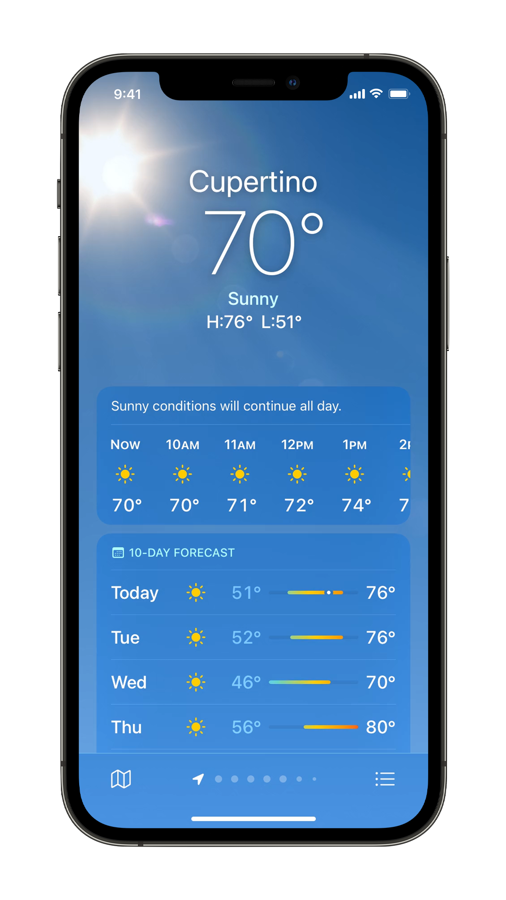

# Academy Project 00 - Weather

| Expected Preparation |
| -------------------- |
| Software Setup       |

## Goal

This project aims to do two things:

1. Give you a idea of what we'll be working towards
2. Give you an introduction to Xcode

This repository contains the models and assets needed to recreate something similar to the **iOS 15 Weather App**. I will be recreating something similar to this in our first meeting. I hope that seeing this demonstration motivates you and gets you excited for app development.

See the screenshot below for the reference image:

